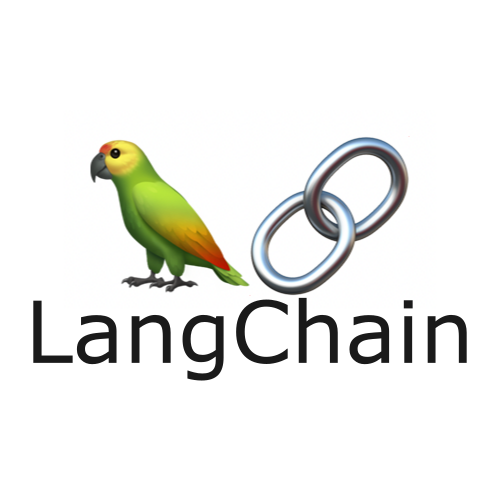
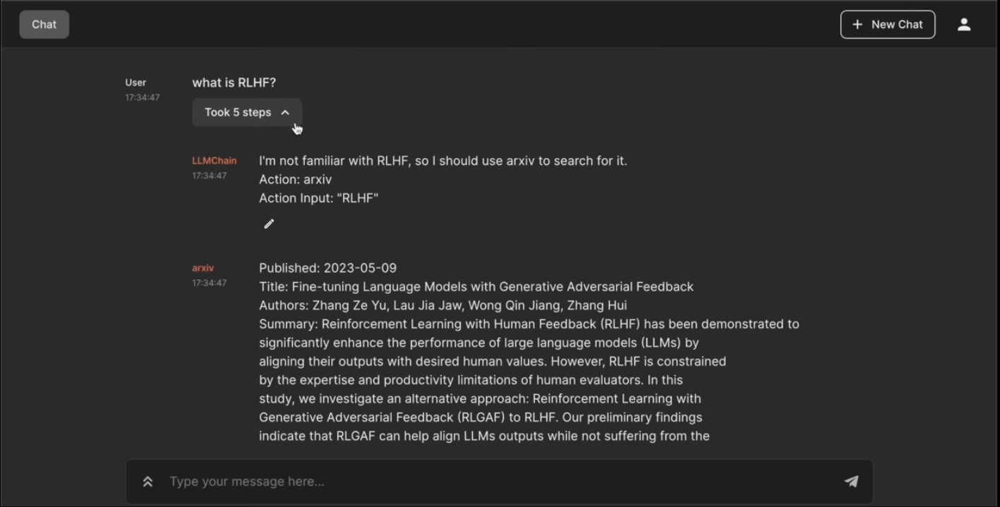
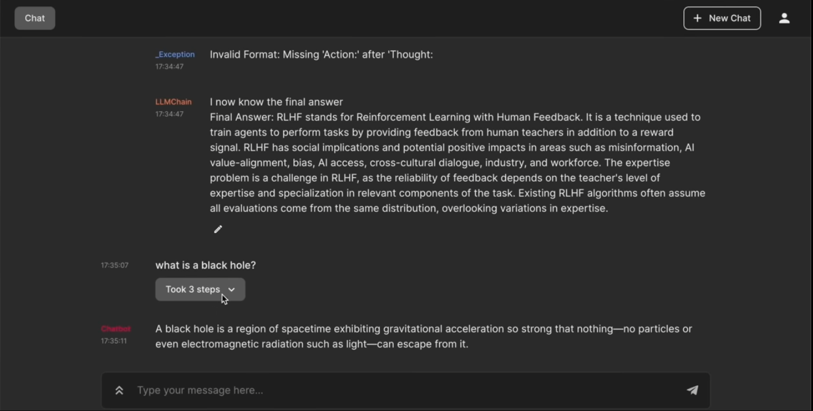

# arXiv Researcher

 

 

# Overview

- This repository is adapted from [this tutorial]() from Freecodecamp regarding how to implement [OpenAI LLM](https://openai.com/) and [Langchain](https://www.langchain.com/) functionality into a [Chainlit](https://docs.chainlit.io/get-started/overview) application to create an [AutoGPT](https://github.com/Significant-Gravitas/AutoGPT)-like bot that can conduct scientific research, with very little code
- The purpose of following this tutorial was to learn more about the Chainlit library, and how it can be used to intergrate LLMs to make applications with AutoGPT functionality
- The content of this repository is very minimal, and simply begins by loading a ChatOpenAI LLM and arXiv tool into an agent, and using that agent to handle user input via the GUI

# Screenshots

